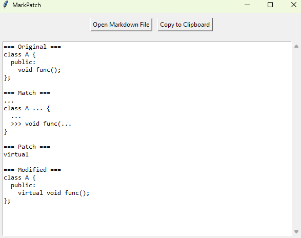

# MarkPatch - Markdown Patch Applicator

Графическое приложение для применения патчей к исходному коду через Markdown-файлы. Удобно управляйте патчами, просматривайте изменения и копируйте результаты в буфер обмена.

## 📋 Особенности

- **Загрузка Markdown-файлов** с секциями:
  - `Source file` — исходный код.
  - `match:` — шаблон для поиска (с wildcards `...` и маркерами `>>>`, `<<<`).
  - `patch` — код для вставки/замены.
- **Визуальное сравнение**:
  - Оригинальный код.
  - Найденный шаблон.
  - Примененный патч.
  - Модифицированный результат.
- **Автоматическое форматирование** пробелов при вставке кода.
- Поддержка **многопоточности** для обработки файлов без зависания интерфейса.

## 🛠️ Установка

1. **Требования**: Python 3.6+.

2. Клонируйте репозиторий:
   ```bash
   git clone https://github.com/Lerdn2050/MarkPatch.git
   cd MarkPatch
   ```

## 🚀 Быстрый старт

1. Запустите программу:
   ```bash
   python Interpreter.py
   ```
2. Нажмите **Open Markdown File** и выберите файл с патчем (пример ниже).
3. Результат отобразится в текстовом поле. Используйте **Copy to Clipboard**, чтобы скопировать его.

## 📄 Пример Markdown-файла

````markdown
# Add virtual


## Source file

```

class A {
  public:
    void func();
};

```


### match:
```
...
class A ... {
  ...
  >>> void func(...
}
```

### patch

```
virtual
```
````

## 📸 Скриншоты


